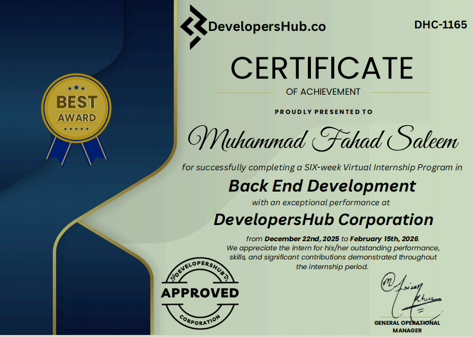
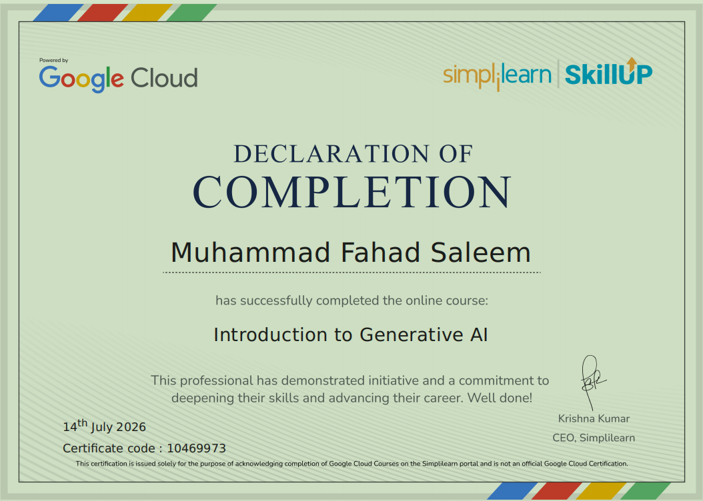

# 👋 Hi, I'm Muhammad Fahad Saleem

### Software Engineer | AI & Python Developer | AI & ML Enthusiast

 

 

---

## 👨‍💻 About Me

I'm a **Final-Year BS Software Engineering student at the University of Haripur**, with a growing focus on **Artificial Intelligence, Machine Learning, and Python-based software development**.

My development journey started with **Backend Development**, where I worked with Python, Flask, databases, and APIs. I later moved deeper into **AI and Machine Learning**, building practical projects and exploring NLP, Generative AI, FastAPI, automation, and AI-powered applications.

I enjoy learning by building — turning concepts into working projects and continuously improving my software engineering skills.

---

## 💼 Experience

### 🤖 AI Specialist Intern

**Glaxit Software House — On-site**
`Jun 2026 – Sep 2026`

* Worked with Machine Learning, NLP, and AI data pipelines.
* Developed AI/ML APIs using FastAPI.
* Worked with AI model deployment and containerization using Docker.
* Practiced automation, evaluation, and monitoring of AI systems.
* Developed practical AI-focused projects during the internship.

### 💻 Backend Developer Intern

**Developers Hub Corporation — Remote**
`Dec 2025 – Feb 2026`

* Developed backend functionality for a Python/Flask-based e-commerce application.
* Worked with SQL and database integration.
* Implemented backend logic and API-related functionality.
* Used Git and GitHub for version control and project collaboration.

---

## 🛠️ Tech Stack

### 💻 Programming & Backend

Python • C++ • Flask • FastAPI • REST APIs

### 📊 Data & Machine Learning

Scikit-learn • Pandas • NumPy • NLTK • TensorFlow • PyTorch

### 🤖 AI & Generative AI

OpenAI API • Google Gemini API • Hugging Face • NLP • Generative AI • LLM Applications

### 🗄️ Databases & Tools

SQLite • MySQL • PostgreSQL • Git • GitHub • VS Code • Linux

---

# 🚀 Featured Projects

### 1. 🤖 Auto Reply AI Chatbot

An AI-powered WhatsApp auto-reply chatbot that reads conversation context and generates intelligent replies using AI.

**Tech:** Python, PyAutoGUI, Pyperclip, OpenAI SDK, Groq API, Llama 3.3

🔗 **[View Repository](https://github.com/mfahadsaleem001/auto-reply-ai-chatbot)**

---

### 2. 🌦️ Weather Tracking System

A university DSA project focused on weather tracking while applying programming and data-structure concepts to a practical system.

**Tech:** C++ / Data Structures & Algorithms

🔗 **[View Repository](https://github.com/mfahadsaleem001/5th_semster_project_DSA)**

---

### 3. 🧠 NoteGenius AI — AI Study Assistant

An AI-powered study assistant designed to process and summarize notes, helping users understand and revise educational content more effectively.

**Tech:** Python, AI, NLP, Generative AI

🔗 **[View Repository](https://github.com/mfahadsaleem001/AI-Notes-Summarizer)**

---

### 4. 👨‍💼 Employee Manager

A Python-based employee management application for managing employee-related information and operations.

**Tech:** Python

🔗 **[View Repository](https://github.com/mfahadsaleem001/employee-manager)**

---

### 5. 🛒 NovaCart — E-Commerce Web Application

A backend-focused e-commerce web application built with Flask, featuring database integration and essential e-commerce functionality.

**Tech:** Python, Flask, SQL

🔗 **[View Repository](https://github.com/mfahadsaleem001/NovaCart)**

---

### 6. 🧭 Career Compass AI

An AI-based career planning system designed to provide intelligent career-related guidance and recommendations.

**Tech:** Python, AI, Machine Learning, Generative AI

🔗 **[View Repository](https://github.com/mfahadsaleem001/careercompass-ai)**

---

### 7. 📚 Novel Scraper & Web-Based Novel Reader

A full-stack novel platform combining a Python-based scraper with a web-based interface for browsing and reading novels.

**Tech:** Python, HTML, CSS, JavaScript

🔗 **[View Repository](https://github.com/mfahadsaleem001/Novel-Scraper)**

---

# 📜 Certifications

<table>

<tr>

<td align="center">

  

<b>Developers Hub Corporation</b>

 

Remote Internship Completion Certificate

</td>

<td align="center">

  

<b>Introduction to Generative AI</b>

 

Certificate

</td>

</tr>

<tr>

<td align="center" colspan="2">

  

<b>Glaxit Software House</b>

 

AI Specialist Internship Certificate

</td>

</tr>

</table>

---

# 📚 Currently Learning

🧠 **Deep Learning**   •  
🤖 **Large Language Models**   •  
✨ **Generative AI**   •  
⚡ **AI APIs**   •  
🐳 **AI Deployment**

---

# 🎯 Development Focus

* 🚀 Build practical AI-powered applications
* 🤖 Develop useful Machine Learning solutions
* 🧠 Explore NLP and LLM technologies
* ⚡ Build scalable Python APIs
* 🐳 Improve AI deployment and containerization skills
* 💻 Improve software architecture and engineering practices
* 🌍 Continue building real-world software projects

---

# 🤝 Open to Collaboration

I'm interested in collaborating on:

 

🤖 **AI & Machine Learning Projects**
🐍 **Python Applications**
🌐 **Flask / FastAPI Projects**
🧠 **NLP & Generative AI Projects**
🚀 **Open Source Projects**

---

# 📊 GitHub Activity

  

---

# 📈 Contribution Graph

---

# 📫 Connect With Me

---

### 💡 Building. Learning. Improving. 🚀

 

